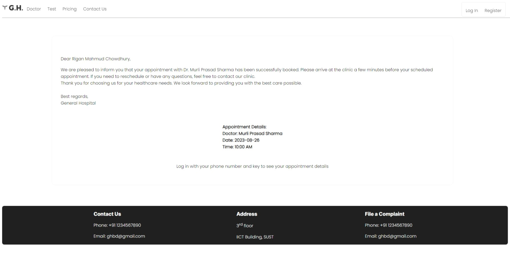

## Project Name: __General Doctor Appointment System__

### Goal:
* To ease the doctor in keeping track of the patients he has checked   
---
__Explanation:__ A doctor has to keep track of the patients he has seen for legal and medical purposes. Keeping a physical record is both tiresome and a matter of inconvenience for the doctor. This web app will automate the process.

* To ease the tedious process of booking a doctor’s appointment.
-----     
__Explanation:__ Booking a doctor’s appointment physically can be bothersome to lots of people. If we could develop a web app that will allow users to book an appointment from their home, it would be of great benefit to the user.

### Users and Roles:
#### Doctor:
* Doctor can see his appointments for the day
* The doctor can also see total the patients he has seen over a certain period of time

#### Patient
* Can book an appointment for his desired doctor
* No need to create an account if the patient doesn’t have one. The app will automatically create an account for him/her.
* The patient can log in to his account(the key will be provided and the patient can retrieve his/her key if forgotten) and check all his/her appointments

### Functionality:
The doctor appointment system app is designed to streamline the appointment booking process for both doctors and patients. It provides a user-friendly interface that allows doctors to manage their schedules, view upcoming appointments, and efficiently allocate their time. Patients, on the other hand, can easily book appointments with their preferred doctors, view available time slots, and keep track of their medical appointments.    
Here's an overview of the functionality for both user types:

#### Functionality for Doctors:
* __Login and Dashboard:__ Doctors can log in to their accounts using unique credentials. 
* __View and Manage Appointments:__ Doctors can view their upcoming appointments in a chronological order.
* __Patient Information:__ For each appointment, doctors can access patient name, age, sex, allocated time.   

#### Functionality for Patients:
* __User Registration and Login:__ Patients can register on the app by providing their personal details. After registration, they can log in to their accounts.
* __Search for Doctors:__ Patients can search for doctors based on name, specialties.
* __Book Appointments:__ Patients can book appointments by selecting a doctor.
Reschedule or Cancel Appointments: Patients can cancel appointments within a specified time frame, considering his/her needs.   

The __database__ plays a crucial role in the doctor appointment system app, serving as the backbone that stores, manages, and retrieves all the necessary information. It supports the app's functionality by enabling efficient data storage, retrieval, and manipulation.    
Here are the primary roles of the database in this project:   

* __User Authentication and Authorization:__ The database stores user credentials, such as usernames and passwords, ensuring authentication during login. It also stores user roles and permissions, determining what actions doctors and patients can perform within the app.
* __Doctor and Patient Profiles:__ The database holds comprehensive profiles for doctors and patients. This includes personal information, contact details, medical specialties. It provides a structured way to retrieve and display information about healthcare providers and patients.
* __Appointment Data:__ Appointment details such as appointment time, date, doctor-patient associations, appointment status (scheduled, cancelled, completed), and any notes are stored in the database. This enables efficient scheduling, tracking, and management of appointments.   

Overall, the database acts as a reliable and structured repository that facilitates seamless interaction between doctors, patients, and the app's features. It enables efficient data storage, retrieval, and manipulation, contributing to the smooth functioning of the doctor appointment system app.

### Technology:
* Embedded Javascript
* NodeJS
* ExpressJS
* MySQL

## Some screenshots

### Home Page:
   

### Tests:

### Prices:
   

### Doctors:
   

### A Doctor's Page:

### A Sample Form:

### Success!!!

### Logged in as a patient:

### A Patient's Page:

### Dr House in the House:

### Dr House's upcoming visits:

### Dr House's visit history:

### Login Page:
